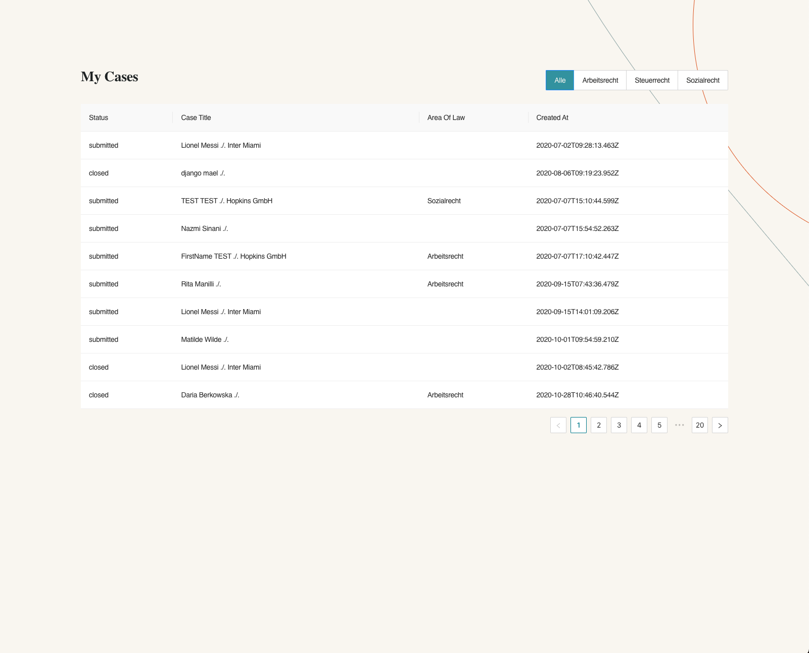
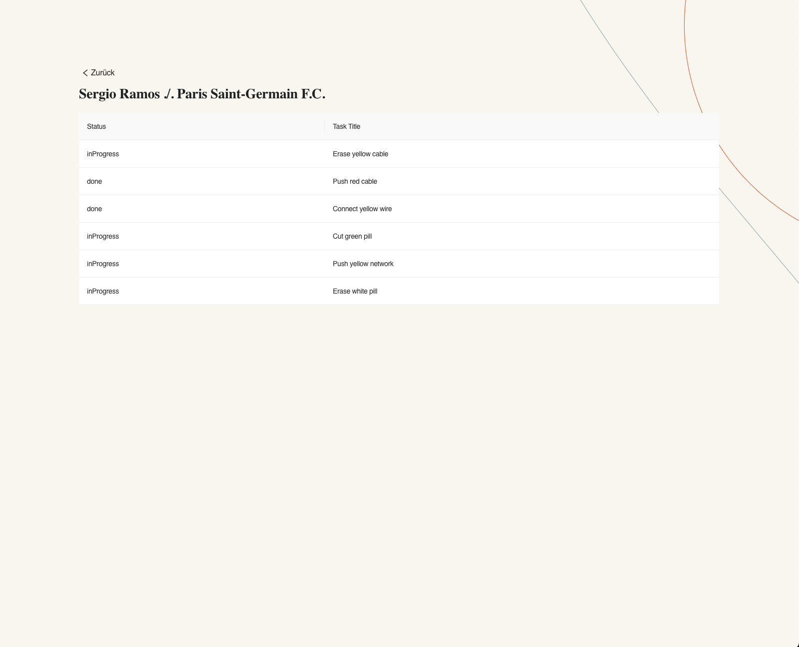

# Hopkins Tech Challenge

Hi, Candidate!
If you're reading this, you've been invited to participate in the Hopkins Tech Challenge. Congratulations! We're excited to see what you can do!

## How to start
 - clone the repo.
 - you supposed to get the `.env` file with the invitation email - put it in the root of the project. If you don't have it - contact us.
 - install all dependencies with `yarn install`.
 - run the project with `yarn start`.

## What you should do
There should be two pages: 'MatterList' and 'MatterDetails'.

## API description
There's a single API route to get the data: (POST) `/${MATTER_URL}`. You'll get `MATTER_URL` in the `.env` and you don't need to set it up. The difference is in the body params:
 - if you want to get the list of Matters - send `{ pageNumber: number, areaOfLaw?: string }`. Notice `pageNumber` is required (starts with 1), and `areaOfLaw` is optional - to get Matters of all Areas of Law, omit the param.
 - if you want to get the details of a single Matter - send `{ id: string }`. It'll return you the Matter object plus the list of random Tasks (they are generated per request, so you'll get different Tasks for the same Matter id).

## Requirements:
 - there should be Spinners indicating loading state, proper error handling, and empty states (e.g. "No Data") on both pages.

### MatterList page
 - there should be a selection of the 'Area Of Law' at the top right corner of the Table. The default value should be 'Alle'. You can find the list of Areas of Law in the `Matter/enums.js` file.
 - there should be pagination at the bottom right corner of the Table. Make sure it works in pair with the Area Of Law filter.
 - clicking on a row in MatterList should get you to the selected MatterDetails page.
 - after you get back to the MatterList page from the MatterDetails page, the pagination and the Area Of Law filter should be in the same state as before you clicked on the row.
 
### MatterDetails page
 - Clicking "Zuruck" should get you back to the MatterList page.

## What we're looking for
 - it's not about pixel-perfect design, but it should look good. Provided screenshots are using AntD components, but you can use any UI library you want. There are some components in the `/shared` folder, but you're free to use your own.
 - we want to check your ability to work with Redux, so make sure your reducers, sagas, selectors, and actions are set up properly.

## How to submit
  - create a new repo on your GitHub account.
  - push your code to the repo.
  - send us the link to the repo.

## Good luck!
